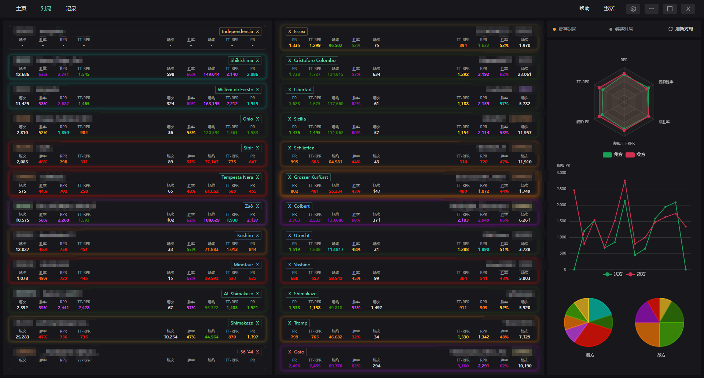
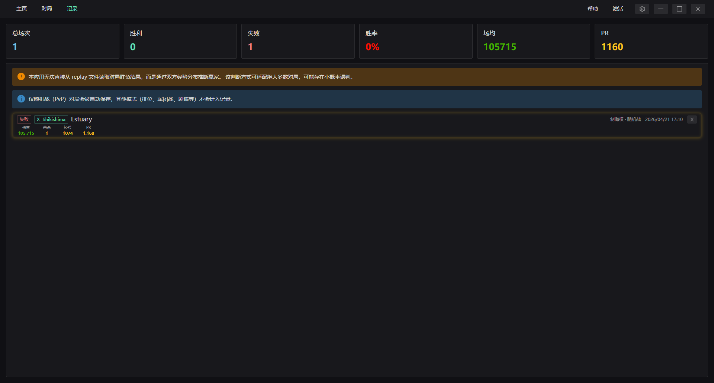
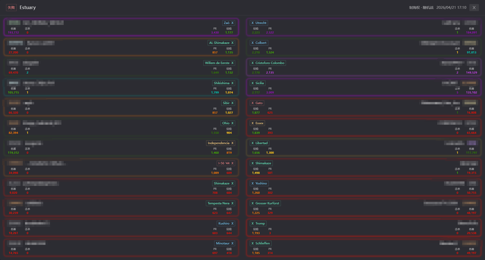

# Mairomachi（迷路町）

> 《战舰世界》(World of Warships) 桌面端对局战绩查询助手

[](https://www.electronjs.org/)
[](https://vuejs.org/)
[](https://www.typescriptlang.org/)
[](https://vitejs.dev/)

---

## 项目简介

**Mairomachi（迷路町）** 是一款基于 **Electron + Vue 3 + TypeScript** 的桌面端游戏辅助应用。它通过监听游戏 `replays/` 目录下的
`tempArenaInfo.json` 文件，实时获取当前对局信息，并向服务端请求玩家统计数据，在界面上展示双方玩家的战绩、舰船信息、公会信息及
PR 评级等数据。

### 核心功能

- **实时对局监控**：使用 `chokidar` 监听游戏 replay 目录，检测到 `tempArenaInfo.json` 时自动拉取对局数据，按舰种/等级/PR
  排序展示敌我双方玩家卡片。
- **战绩记录管理**：对局结束后自动解析本地 `.wowsreplay` 文件（纯 Node.js
  解析引擎），提取单场战斗详情（伤害、击杀、经验等）并本地缓存；支持在战绩页面浏览历史记录并查看详情。
- **设备认证体系**：首次使用输入邀请码激活设备，生成 Ed25519 密钥对并与设备指纹绑定；后续自动登录使用私钥签名，无需重复输入。
- **多语言与主题切换**：支持简体中文界面，舰船名称可在简中/繁中/英文/日文之间切换；支持明亮/黑暗主题。

### 主要页面展示

- 对局监控页面

- 对局记录页面

- 对局记录详情页面


---

## 技术栈

| 层级        | 技术                                                 |
| ----------- | ---------------------------------------------------- |
| 桌面框架    | Electron `^39.2.6`                                   |
| 前端框架    | Vue 3 `^3.5.25` (Composition API + `<script setup>`) |
| 类型系统    | TypeScript `^5.9.3`（严格模式）                      |
| 构建工具    | Vite `^7.2.6` (via `electron-vite`)                  |
| UI 组件库   | Naive UI `^2.44.1`                                   |
| 图表        | ECharts `^6.0.0` + vue-echarts `^8.0.1`              |
| 状态/存储   | `ref` / `reactive` / `electron-store`                |
| HTTP        | Axios `^1.15.0`                                      |
| 文件监控    | chokidar `^5.0.0`                                    |
| Replay 解析 | 纯 Node.js 引擎（`adm-zip` + Buffer 扫描）           |
| 包管理器    | pnpm                                                 |

---

## 项目结构

```
src/
├── main/                          # 主进程（Node.js / Electron）
│   ├── http/
│   │   └── client.ts              # Axios 封装：JWT、Ed25519 签名、拦截器
│   ├── service/
│   │   ├── arena-monitor-service.ts   # chokidar 文件监控与 replay 解析触发
│   │   ├── arena-info-service.ts      # 对局数据获取与缓存
│   │   ├── auth-service.ts            # 设备激活、登录、Token 刷新
│   │   ├── config-service.ts          # 配置管理
│   │   ├── file-service.ts            # 系统目录选择对话框
│   │   ├── logger.ts                  # 主进程日志管理器（支持文件持久化）
│   │   ├── ship-info-service.ts       # 舰船信息缓存服务
│   │   └── update-service.ts          # 检查更新与静默安装
│   ├── store/
│   │   ├── config-store.ts        # 应用配置存储
│   │   ├── key-store.ts           # 设备密钥存储（私钥使用 safeStorage 加密）
│   │   ├── record-store.ts        # 战绩记录缓存
│   │   └── token-store.ts         # JWT Token 存储
│   ├── type/                      # 主进程类型定义
│   ├── utils/                     # 工具函数（Ed25519、设备指纹、diff、IPC 发送）
│   ├── index.ts                   # 主进程入口
│   └── ipc-handlers.ts            # IPC 处理器注册
├── preload/
│   ├── index.ts                   # Preload 脚本：暴露类型安全的 IPC API
│   └── index.d.ts                 # Window 接口类型声明
├── renderer/
│   ├── src/
│   │   ├── assets/                # 全局样式
│   │   ├── components/            # Vue 组件（PlayerCard、图表、RecordCard 等）
│   │   ├── composables/           # 组合式函数（useAsync、useSwitch）
│   │   ├── layout/                # 页面级组件（Dashboard、ArenaMonitorPage、RecordPage 等）
│   │   ├── main.ts                # 渲染进程入口
│   │   └── App.vue                # 根组件
│   ├── index.html
│   ├── auto-imports.d.ts          # auto-import 类型声明
│   └── components.d.ts            # 组件自动导入类型声明
└── shared/                        # 主进程与渲染进程共享的类型与常量
    ├── constants/
    │   └── ships.ts               # 舰船静态常量（罗马数字、舰种标签映射）
    ├── ipc-types.ts
    ├── ipc.ts
    ├── security.ts                # 外部链接白名单
    └── types.ts
```

---

## 开发指南

### 环境要求

- Node.js 22+
- pnpm 10+
- Windows（开发环境当前以 Windows 为主）

### 安装依赖

```bash
pnpm install
```

### 常用命令

```bash
# 启动开发服务器（支持 HMR）
pnpm dev

# 预览生产构建
pnpm start

# 类型检查（node + web）
pnpm typecheck

# 代码检查与格式化
pnpm lint
pnpm format

# 构建输出到 out/ 目录
pnpm build

# 打包为 Windows 安装程序（NSIS .exe）
pnpm build:win

# 打包为 macOS .dmg
pnpm build:mac

# 打包为 Linux 包（AppImage / deb）
pnpm build:linux
```

---

## 认证流程

1. **首次激活**
   - 用户输入邀请码（激活码）。
   - 客户端生成本地 Ed25519 密钥对 + 设备指纹（基于 OS 信息 SHA256）。
   - 调用 `POST /api/v1/auth/activate`，上传公钥和设备指纹，获取 JWT。
   - 使用 `electron-store` 保存：加密后的私钥、公钥、设备指纹、原始激活码。

2. **自动登录**
   - 启动时从 `key-store` 读取激活码和私钥。
   - 构造签名载荷：`METHOD|URI|timestamp|nonce`。
   - 使用私钥进行 Ed25519 签名，通过请求头发送。
   - 调用 `POST /api/v1/auth/login`，获取新 JWT。
   - 登录成功后自动初始化舰船信息缓存。

3. **Token 刷新**
   - 当 Token 临近过期时，调用 `POST /api/v1/auth/refresh` 获取新 Token。

4. **登出**
   - 清除本地 JWT Token 和所有密钥凭证。

---

## 安全特性

- **渲染进程沙箱**：启用 Chromium 沙箱隔离，Preload 脚本通过 `contextBridge` 暴露最小 API 集。
- **外部链接白名单**：`shell.openExternal` 仅允许 `wows-numbers.com` 和 `developers.wargaming.net`，拦截危险协议与非预期域名。
- **路径遍历防护**：游戏路径解析前校验 `replays` 目录与 `WorldOfWarships.exe` 存在性，拒绝越界访问。
- **更新文件校验**：下载安装包后执行 SHA-256 哈希比对，不匹配则拒绝安装。

---

## 主要页面

| 页面                 | 说明                                                                   |
| -------------------- | ---------------------------------------------------------------------- |
| **LaunchPage**       | 应用启动页：加载动画、自动登录、Token 刷新、错误重试。                 |
| **ActivatePage**     | 设备激活页：输入邀请码，完成首次绑定。                                 |
| **ArenaMonitorPage** | 对局监控主页面：实时展示敌我双方玩家卡片与右侧图表面板。               |
| **RecordPage**       | 战绩记录列表页：展示本地缓存的 replay 解析结果，点击卡片进入详情抽屉。 |
| **RecordDetailPage** | 战绩详情页：分 `allies` / `enemies` 两栏展示单局 replay 中的玩家数据。 |
| **SettingsPage**     | 设置弹窗：游戏目录、自动监控、战绩缓存天数、主题、UI 方向、语言等。    |
| **HelpPage**         | 帮助页面：使用说明与常见问题。                                         |

---

## 文档导航

| 文档                                 | 内容                   |
| ------------------------------------ | ---------------------- |
| [CHANGELOG.md](./CHANGELOG.md)       | 版本变更日志           |
| [CONTRIBUTING.md](./CONTRIBUTING.md) | 贡献指南与开发环境搭建 |

---

## 许可证

[MIT](./LICENSE)
